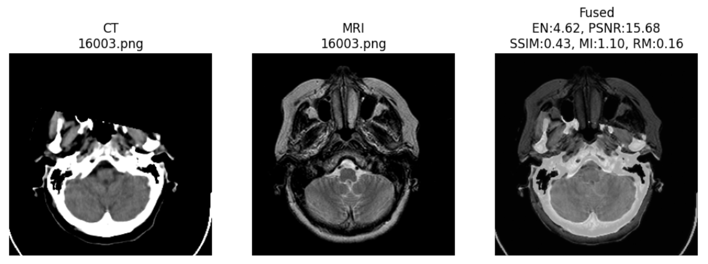
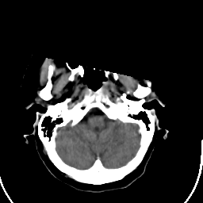
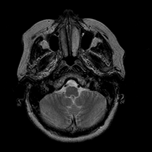
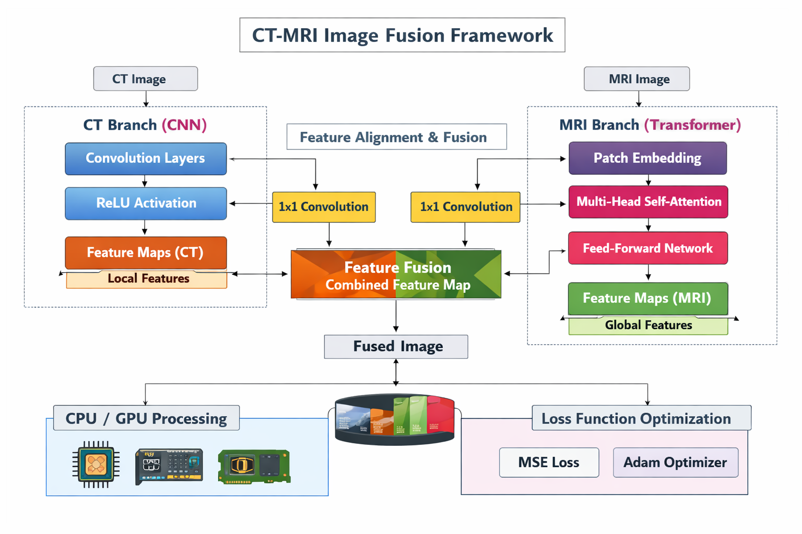
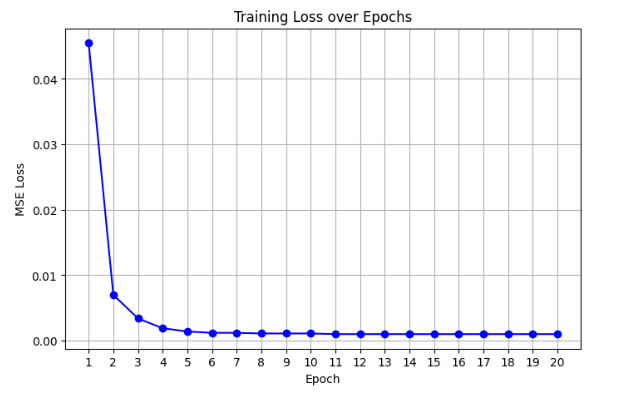
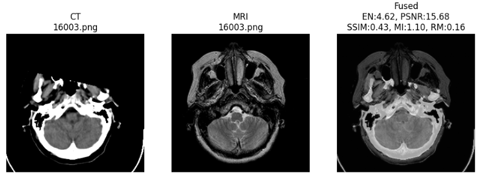
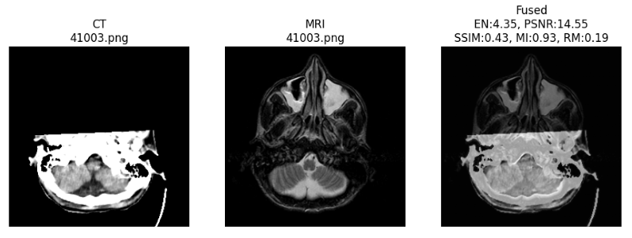

# 🧠 Enhanced Diagnostic Imaging through Multi-Modal Image Fusion


### Hybrid CNN–Transformer Architecture for Medical Image Fusion

---

# 📋 Project Overview

This project presents a **deep learning based multimodal medical image fusion system** designed to enhance diagnostic imaging by combining **CT (Computed Tomography)** and **MRI (Magnetic Resonance Imaging)** scans.

Different medical imaging modalities capture different anatomical details.  
- **CT images** highlight bone structures.  
- **MRI images** capture soft tissue information.

By fusing both modalities into a **single informative image**, the system improves visualization and helps in more accurate medical diagnosis.

The proposed method uses a **Hybrid CNN–Transformer architecture** where:

- **CNN extracts spatial features**
- **Transformer captures global contextual information**

---

# 🖼 Example of Image Fusion



*Example showing CT image, MRI image, and the final fused output.*

---

# 🚀 Key Features

✔ Hybrid CNN–Transformer architecture  
✔ Multimodal medical image fusion (CT + MRI)  
✔ CNN for spatial feature extraction  
✔ Transformer for global dependency modeling  
✔ Feature fusion layer combining both representations  
✔ Quantitative evaluation using image quality metrics  

---

# 🧠 Methodology

## 1️⃣ Data Collection

Dataset Source: **Havard Medical Image Fusion Datasets CT-MRI **

Dataset Statistics:

| Type | Count |
|-----|------|
| CT Images | 184 |
| MRI Images | 184 |
| Total Images | 368 |

Example dataset images:

 
CT Image 16003.png
 
MRI Image 16003.png

---

## 2️⃣ Data Preprocessing

The following preprocessing steps are applied:

- Convert images to **grayscale**
- Normalize pixel values to **[0,1]**
- Resize images to **256 × 256**
- Split dataset into **80% training** and **20% testing**

---

# 🏗️ Model Architecture: CT-MRI Image Fusion Framework

This project implements a hybrid deep learning framework designed to fuse **CT** and **MRI** medical images. By combining **Convolutional Neural Networks (CNNs)** for local structural details and **Transformers** for global context, the model produces a high-fidelity fused output.

---

## 🧩 Network Components

### 1. CT Branch (CNN-based)
Focuses on **Local Feature Extraction**. CT scans contain high-frequency structural information (like bone density) that requires precise spatial mapping.
* **Convolution Layers:** Extract hierarchical spatial features.
* **ReLU Activation:** Introduces non-linearity to learn complex structural patterns.
* **Local Feature Maps:** Captures fine-grained edges and textures.

### 2. MRI Branch (Transformer-based)
Focuses on **Global Feature Extraction**. MRI scans provide rich soft-tissue contrast where long-range dependencies across the image are critical.
* **Patch Embedding:** Segments the image into patches for sequence-based processing.
* **Multi-Head Self-Attention (MHSA):** Relates different regions of the MRI to capture overall context.
* **Feed-Forward Network (FFN):** Refines attention-based features for deeper representation.

### 3. Feature Alignment & Fusion
This module bridges the gap between the two distinct architectural styles:
* **1x1 Convolutions:** Used for dimensionality reduction and channel-wise alignment between the CNN and Transformer outputs.
* **Feature Fusion:** Integrates local structural features (CT) with global contextual features (MRI) into a **Combined Feature Map**.
* **Image Reconstruction:** A decoder stage transforms the fused map into the final **Fused Image**.

---

## Architecture Diagram



---

# ⚙️ Technology Stack

| Component | Technology |
|-----------|------------|
| Programming Language | Python |
| Deep Learning Framework | PyTorch |
| Image Processing | OpenCV |
| Data Handling | NumPy |
| Visualization | Matplotlib, Seaborn |
| Platform | Google Colab |
| Version Control | GitHub |

---

# 📊 Training Details

Training Configuration:

| Parameter | Value |
|----------|------|
| Optimizer | Adam |
| Learning Rate | 0.001 |
| Loss Function | Mean Squared Error |
| Epochs | 20 |
| Batch Size | 4 |
| Training Device | GPU |

Training Loss Progress:



Initial Loss ≈ **0.0358**  
Final Loss ≈ 0.0024

Analysis:
The training loss shows a sharp decrease during the initial epochs, indicating that the model quickly learns important features from the data.  
After a few epochs, the loss gradually stabilizes and reaches a very low value, showing that the model has converged effectively.  
The smooth and consistent curve indicates stable training without significant fluctuations or overfitting.
---
# 🏆 Performance Evaluation

The fused images are evaluated using several metrics.

| Metric | Description |
|------|-------------|
| Entropy | Information content |
| PSNR | Image similarity |
| SSIM | Structural similarity |
| Mutual Information | Shared information |
| RMSE | Reconstruction error |

### Average Results

| Metric | Value |
|------|------|
| Entropy | 4.48 |
| PSNR | 15.34 |
| SSIM | 0.52 |
| Mutual Information | 1.14 |
| RMSE | 0.17 |

---

# 📷 Fusion Results

Example fused outputs generated by the model.





---
## 📂 Project Structure

```
Enhanced-Diagnostic-Imaging-Through-Multi-modal-Fusion/
│
├── docs/
│   ├── CNN.pdf
│   ├── GAN.pdf
│   └── Conference paper.pdf
│
├── images/
│   ├── ct_sample.png
│   ├── mri_sample.png
│   ├── fusion_example.png
│   ├── fusion1.png
│   ├── fusion2.png
│   └── training_loss.png
│
├── results/
│   │
│   ├── CNN Model Results/
│   │   ├── Qualitative/
│   │   │   └── CNN_fused_result.png
│   │   └── Quantitative/
│   │       └── metrics_results.png
│   │
│   ├── GAN Model Results/
│   │   ├── Qualitative/
│   │   │   └── GAN_fused_result.png
│   │   └── Quantitative/
│   │       └── gan_metrics_result.png
│   │
│   ├── Proposed Model Results/
│   │   ├── Graphs/
│   │   │   ├── Entropy_Comparision_ct_vs_mri_fused_graph.png
│   │   │   ├── PSNR_Comparision_ct_fused_vs_mri_fused_graph.png
│   │   │   └── SSIM_Comparision_ct_fused_vs_mri_fused.png
│   │   │
│   │   ├── Qualitative/
│   │   │   └── Fused_results.png
│   │   │
│   │   └── Quantitative/
│   │       └── Metrics_results.png
│   │
│   └── Comparison results of Existing vs Proposed/
│       ├── entropy_graph.jpg
│       ├── mi_graph.png
│       ├── psnr_graph.png
│       ├── rmse_graph.jpg
│       └── ssim_graph.jpg
│
├── src/
│   ├── capstone_2 (1).py
│   ├── cnn_fusion.py
│   └── gan_fusion.py
│
├── architecture.png
├── demo_video_link.txt
├── requirements.txt
├── setup_instructions.md
└── README.md
```
---

# 🔮 Future Work

• Improve fusion strategy using advanced attention mechanisms  
• Train on **larger medical datasets**  
• Extend model to **PET-MRI or multi-modal fusion**  
• Develop **real-time clinical diagnostic systems**
